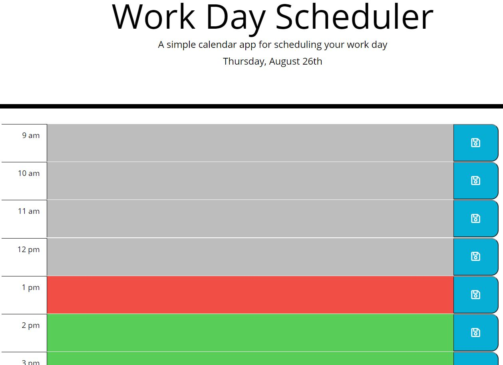

Work Day Scheduler

This work day planner will show the current day and date in the header. There is a row for each hour
of the workday.  Each row will change color based on the time of day to represent a past, present, and future state.
After entering an event, click the save button to the right of the row.  The event is now saved in local storage and 
will be retrieved on refresh. Events entered in past or present rows will not be saved to be retreived upon refresh.

These files for this project can be found in the following location:

* [GitHub Repsoitory](https://github.com/rgfitzhugh/day-planner)

To access the password generator directly visit

* [Day Planner Url](https://rgfitzhugh.github.io/day-planner/)

